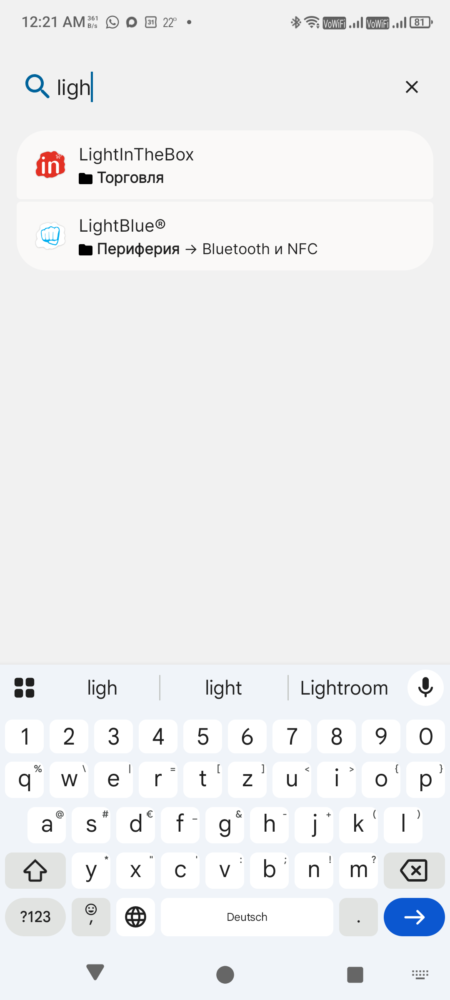

<p align="center">
  
</p>

# BlownChart

A simple, fast Android home screen launcher with categorized folders and a real screen-lock mode — a fork of
[Lawnchair](https://github.com/LawnchairLauncher/lawnchair).

**This is a fork of Lawnchair. Original project:
https://github.com/LawnchairLauncher/lawnchair. Licensed under the GNU
General Public License v3.0 (GPLv3), same as the original.** See
[`LICENSE`](LICENSE), [`LICENSE.txt`](LICENSE.txt) and [`NOTICE`](NOTICE)
for the full license text and the exact license boundaries between the
AOSP-derived code and the GPLv3 Lawnchair/BlownChart code.

[](LICENSE)
[](https://github.com/wolk-tambowskij/blownchart/actions/workflows/ci.yml)
[](https://github.com/wolk-tambowskij/blownchart/releases)

### Screenshots / Скриншоты



App drawer search shows which folder an app is in, including the full path for a nested subfolder — long paths wrap onto a second line instead of getting cut off.<br>
Поиск в меню приложений показывает, в какой папке находится приложение, включая полный путь для вложенной подпапки — длинный путь переносится на вторую строку вместо обрезки.

https://github.com/wolk-tambowskij/blownchart/raw/15-dev/docs/assets/screenshots/nested_folders.mp4

[▶ Watch: nested folders / Смотреть: вложенные папки](docs/assets/screenshots/nested_folders.mp4)

Nested folders: create one by dropping a folder onto another, open it right where it was tapped, and drag it straight out to the home screen.<br>
Вложенные папки: создание перетаскиванием одной папки на другую, открытие прямо там, где её нажали, и перетаскивание сразу на домашний экран.

[▶ Watch: settings lock / Смотреть: блокировка настроек](docs/assets/screenshots/settings-lock.mp4)

A PIN/fingerprint lock for the launcher's own settings and any exit into system Settings.<br>
Защита PIN-кодом/отпечатком пальца для настроек лончера и любого перехода в системные настройки.

[▶ Watch: split lock / Смотреть: раздельная блокировка](docs/assets/screenshots/split-lock.mp4)

App drawer lock and home screen lock as separate settings, each covering its own surface.<br>
Блокировка меню приложений и блокировка рабочего стола — отдельные настройки, каждая для своей поверхности.

[▶ Watch: backup and restore / Смотреть: резервное копирование](docs/assets/screenshots/backup-restore.mp4)

Backup and restore covering the full home screen layout, widgets, and grid size in a single pass, plus an optional separate backup of the lock screen wallpaper.<br>
Резервное копирование и восстановление за один проход сохраняют структуру рабочего стола, виджеты и размер сетки, а также опционально — обои экрана блокировки отдельно от обоев рабочего стола.

---

## English

### Why this fork exists

BlownChart started because a simple wish had no ready-made answer: a
launcher that categorizes apps into folders right in the app drawer, stays
fast even with a large number of apps and categories, and can fully lock
its settings and layout down (important once the drawer has grown large
and you don't want to reorganize it by accident). Nothing off-the-shelf
covered all three, so this fork builds on Lawnchair's solid Launcher3
foundation to add them.

### Differences from the original

The wording below mirrors the in-app changelog (Settings → About → What's
new), so the two stay in sync as features change.

Folders (app drawer and home screen):

- One level of folder-in-folder nesting, with its own manual ordering
  (nested folders always sort before apps) and a small badge marking a
  folder that contains another. In the app drawer, nest a folder from
  Settings; on the home screen, drag one folder onto another and release
  quickly to wrap both into a new nested folder, or hold until the
  target springs open to merge into its existing contents. Answers a
  long-standing upstream feature request, [lawnchair#5435](https://github.com/LawnchairLauncher/lawnchair/issues/5435).
- Choice between manual folder ordering and alphabetical sorting
  (default).
- Search bar when choosing apps for a folder or for the hidden-apps list.
- Export and import your folder layout as a JSON file with all
  parameters.
- Thin outline added to folders on the home screen and in the drawer.
  Folder previews no longer overflow their bounds for any number of
  apps and any icon shape, and update immediately when you change the
  icon shape setting instead of the old shape lingering on them until
  the app was restarted. Related to upstream
  [lawnchair#6495](https://github.com/LawnchairLauncher/lawnchair/issues/6495)
  (closed, but only on the newer 16-dev branch).
- Faster "App drawer folders" screen and folder editing with large
  numbers of installed apps — tested under real-world load (40 folders,
  1766 installed apps) to catch and fix the slowdowns that only show up
  at that scale. Targets upstream
  [lawnchair#6147](https://github.com/LawnchairLauncher/lawnchair/issues/6147),
  which is still open on 15-dev; a similar rewrite,
  [#6996](https://github.com/LawnchairLauncher/lawnchair/pull/6996),
  already landed upstream but only on the newer 16-dev branch.
- App drawer search results show which folder an app is in (with its
  icon), including the full path for an app inside a nested subfolder.
- Confirmation dialog before deleting a folder, warning if it contains
  nested folders.
- A folder in the app drawer (including one with a nested subfolder) can
  be dragged straight onto the home screen, creating a real copy there
  with all its apps and its name — the app drawer's own folder is left
  untouched.

Privacy and locking:

- "Lock app drawer" and "Lock home screen" are separate settings:
  locking the app drawer blocks renaming, hiding, changing the icon,
  and uninstalling apps from the drawer, while locking the home screen
  also separately blocks moving and resizing widgets, the Uninstall
  shortcut from any surface, and new widget placement — closing a
  bypass the drawer lock alone didn't cover. Fixes upstream
  [lawnchair#5839](https://github.com/LawnchairLauncher/lawnchair/issues/5839):
  reporters wanted "Lock home screen" to leave the app drawer alone,
  which the old single flag couldn't do. The uninstall/widget bypass
  half is also related to
  [lawnchair#6929](https://github.com/LawnchairLauncher/lawnchair/issues/6929).
- A PIN/fingerprint lock for the launcher's own settings and any exit
  into system Settings (does not apply to shortcuts/widgets created by
  third-party apps, or to opening settings through system UI elements
  such as a quick-settings tile).
- The launcher's own app drawer entry is hidden by default.

Backup and restore:

- Backup and restore now reliably cover the full home screen layout,
  widgets, and grid size in a single pass, without crashing or needing
  to run twice. Related to upstream
  [lawnchair#6576](https://github.com/LawnchairLauncher/lawnchair/issues/6576)
  ("requires 2 restore processes") — that report is about a cross-version
  restore (15→16), while this fix targets the same-version (15→15) case,
  so it's not confirmed to be the identical root cause.
- Optional: back up the lock screen's wallpaper independently of the
  home screen one, with a live preview next to the home wallpaper on
  the backup and restore screens. Fixes upstream
  [lawnchair#5462](https://github.com/LawnchairLauncher/lawnchair/issues/5462)
  ("restore overwrites my lock screen wallpaper").

Other:

- Experimental: opens the real Recents/Overview screen from the
  physical Recents button or a double-tap gesture, on firmware where
  invoking it directly renders it broken (flashes and disappears).
- Faster first launch and app drawer loading with a large number of
  installed apps, building in part on a thread-scheduling fix and a
  batched icon-loading optimization borrowed from Lawnchair 16's
  development branch (see
  [`docs/pr/fix-loader-model-thread-priority.md`](docs/pr/fix-loader-model-thread-priority.md)).
  The thread-scheduling half shares its root cause with upstream's own
  fix for Bug 396250724; the batched icon-loading half is unsolicited,
  separate work.
- A persistent prompt to exempt the launcher from battery optimization,
  since a one-time prompt is too easy to dismiss and forget.
- Rebranded identity (name, icon, `applicationId`) so it can be installed
  side by side with Lawnchair itself; hand-maintained Russian
  translations instead of upstream's Crowdin-managed ones; signed
  CI/release workflows and periodic upstream-sync tracking (see
  [`.github/workflows/`](.github/workflows/)).

### Download

**[Releases](https://github.com/wolk-tambowskij/blownchart/releases)** —
signed APKs, built and published via GitHub Actions from `15-dev`.
BlownChart v1.0.0 is based on
[Lawnchair v15.0.0-beta3.0](https://github.com/LawnchairLauncher/lawnchair/releases/tag/v15.0.0-beta3.0);
see [`docs/UPSTREAM_SYNC.md`](docs/UPSTREAM_SYNC.md) for how later
upstream changes are tracked, and the CI/release workflows under
[`.github/workflows/`](.github/workflows/).

### Known issues and recommendations

- **Background restrictions**: some device manufacturers limit background
  apps more aggressively than stock Android, which can affect widgets,
  notifications, and system gesture integration. If BlownChart misbehaves
  after switching away from it, check your device's battery/autostart
  settings — for example, DuraSpeed on some MediaTek-based devices, or the
  separate Autostart manager on MIUI-based Xiaomi devices. The exact menu
  name and location vary by manufacturer.
- **Double tap to sleep**: for the most reliable screen lock on devices
  where the accessibility-based method doesn't work, grant BlownChart
  device administrator access when prompted (Gestures → Double tap →
  Sleep).
- **Recents/Overview screen not taking over**: on some firmware, the OS
  hardcodes a different app as the system's Recents-screen provider
  (`config_recentsComponentName`) regardless of BlownChart being set as
  the default launcher. When this happens, BlownChart detects the
  mismatch and disables its own Quickstep/Recents integration rather than
  silently failing. This is a device/firmware-level restriction, outside
  what this fork — or upstream Lawnchair — can fix from application code.

### Build

Requirements: JDK 17, Android SDK, and the NDK/CMake versions pinned in
`build.gradle`.

```sh
git clone --recurse-submodules https://github.com/wolk-tambowskij/blownchart.git
cd blownchart
git checkout 15-dev

# List all available build variants
./gradlew tasks --group=build

# Debug build (unsigned), GitHub/FOSS channel
./gradlew assembleLawnWithQuickstepGithubDebug
```

You can also open the project directly in Android Studio and build/run any
variant from the Build Variants panel.

A signed **release** build additionally needs signing credentials. Create a
`keystore.properties` file at the repository root (already covered by
`.gitignore`, never commit it):

```properties
storeFile=/absolute/path/to/your.keystore
storePassword=...
keyAlias=...
keyPassword=...
```

then run e.g. `./gradlew assembleLawnWithQuickstepGithubRelease`. In CI,
the same signing config is fed from GitHub Secrets instead of this file.

### Support the project

BlownChart is free and always will be — donating never unlocks a feature,
that would contradict both the spirit and the letter of the GPLv3. If
you'd still like to chip in, it's in-app under
`Settings → About → Support development`, or directly:

- **PayPal:** https://www.paypal.com/donate/?business=wolk.tambowskij%40gmail.com&currency_code=USD
- **YooMoney (ЮMoney):** https://yoomoney.ru/to/4100119588109985

See [`docs/DONATIONS.md`](docs/DONATIONS.md) for how the config works and
why the Google Play build hides direct payment links.

### License and attribution

- Full license texts: [`LICENSE`](LICENSE) (GPLv3), [`LICENSE.txt`](LICENSE.txt) (Apache-2.0).
- License boundaries and copyright: [`NOTICE`](NOTICE).
- Third-party code carried over from other projects: [`THIRD_PARTY.md`](THIRD_PARTY.md).
- Contributing to Lawnchair upstream: [`CONTRIBUTING.md`](CONTRIBUTING.md).

---

## Русский

### Зачем этот форк

BlownChart появился из-за того, что на простое желание не нашлось готового
ответа: лончер, который раскладывает приложения по категориям прямо в меню
приложений (app drawer), остаётся быстрым даже при большом количестве
приложений и категорий, и умеет полностью заблокировать свои настройки и
раскладку (это важно, когда меню приложений уже разрослось и не хочется
случайно всё переорганизовать). Готового решения, закрывающего все три
пункта разом, в открытом доступе найти не удалось — поэтому форк строится
поверх прочной базы Lawnchair/Launcher3.

### Отличия от оригинала

Формулировки ниже повторяют список изменений в самом приложении
(Настройки → О приложении → Что нового), чтобы README и приложение не
расходились.

Папки (меню приложений и домашний экран):

- Один уровень вложенности папок друг в друга, с собственной ручной
  сортировкой (вложенные папки всегда идут перед приложениями) и
  небольшим значком, отмечающим папку с вложенной папкой внутри. В меню
  приложений вложить папку можно через настройки; на домашнем экране —
  перетащить одну папку на другую и быстро отпустить, чтобы обернуть
  обе в новую вложенную папку, либо дождаться, пока папка раскроется, и
  отпустить — чтобы объединить с её содержимым. Закрывает давний запрос
  в апстриме,
  [lawnchair#5435](https://github.com/LawnchairLauncher/lawnchair/issues/5435).
- Выбор между ручной сортировкой папок и сортировкой по алфавиту (по
  умолчанию).
- Строка поиска при выборе приложений для папки или в списке скрытых
  приложений.
- Экспорт/импорт структуры папок в формате JSON со всеми параметрами.
- Добавлена тонкая рамка для папок на рабочем столе и в меню
  приложений. Иконки больше не выходят за края превью папки — для
  любого количества приложений и любой формы иконок — и сразу
  обновляются при смене формы, вместо того чтобы старая форма
  оставалась на значках папок до перезапуска приложения. По теме
  апстрим-issue
  [lawnchair#6495](https://github.com/LawnchairLauncher/lawnchair/issues/6495)
  (закрыт, но только в ветке 16-dev).
- Ускорено открытие экрана «Папки в меню приложений» и редактирование
  папок при большом количестве установленных приложений — проверено на
  реальной нагрузке (40 папок, 1766 приложений), чтобы найти и
  исправить замедления, которые проявляются только при таком масштабе.
  Решает ту же проблему, что и открытый в апстриме
  [lawnchair#6147](https://github.com/LawnchairLauncher/lawnchair/issues/6147)
  (там же остаётся открытым для ветки 15-dev); похожая переработка,
  [#6996](https://github.com/LawnchairLauncher/lawnchair/pull/6996), уже
  влита в апстрим, но только в более новую ветку 16-dev.
- В результатах поиска в меню приложений теперь показывается, в какой
  папке находится приложение (с иконкой папки), а для вложенных папок —
  полный путь.
- Диалог подтверждения перед удалением папки, с предупреждением, если
  внутри есть вложенные папки.
- Папку в меню приложений (в том числе с вложенной подпапкой) теперь
  можно перетащить прямо на домашний экран — там появится настоящая
  копия со всеми приложениями и названием, а сама папка в меню
  приложений останется без изменений.

Приватность и блокировка:

- Блокировка рабочего стола и блокировка меню приложений — теперь
  отдельные настройки: блокировка меню приложений запрещает
  переименование, скрытие, смену иконки и удаление приложений из меню,
  а блокировка рабочего стола дополнительно запрещает перемещение и
  изменение размера виджетов, ярлык «Удалить» на любой поверхности и
  размещение новых виджетов — закрыт обход, который не перекрывала
  только блокировка меню приложений. Закрывает апстрим-issue
  [lawnchair#5839](https://github.com/LawnchairLauncher/lawnchair/issues/5839):
  авторы обращения хотели, чтобы «Блокировка рабочего стола» не
  затрагивала меню приложений, а старый единый переключатель не позволял
  этого сделать. Обход через ярлык «Удалить»/виджеты также по теме
  [lawnchair#6929](https://github.com/LawnchairLauncher/lawnchair/issues/6929).
- Защита PIN-кодом/отпечатком пальца для настроек лончера и любого
  перехода в системные настройки (не работает для ярлыков/виджетов,
  созданных сторонними приложениями, а также для открытия настроек
  через элементы системного интерфейса, например плитку быстрых
  настроек).
- Собственный пункт лончера в меню приложений по умолчанию скрыт.

Резервное копирование и восстановление:

- Резервное копирование и восстановление теперь надёжно сохраняют
  структуру рабочего стола, виджеты и размер сетки за один проход, без
  сбоев и без необходимости запускать восстановление дважды. По теме
  апстрим-issue
  [lawnchair#6576](https://github.com/LawnchairLauncher/lawnchair/issues/6576)
  («требуется 2 восстановления») — там речь о восстановлении между
  версиями (15→16), а этот фикс закрывает случай в пределах одной версии
  (15→15), так что совпадение первопричины не подтверждено.
- Опционально: резервное копирование обоев экрана блокировки отдельно
  от обоев рабочего стола, с предпросмотром рядом с обоями рабочего
  стола на экранах создания и восстановления резервной копии. Закрывает
  апстрим-issue
  [lawnchair#5462](https://github.com/LawnchairLauncher/lawnchair/issues/5462)
  («восстановление перезаписывает обои экрана блокировки»).

Прочее:

- Экспериментально: физическая кнопка «Недавние»/Overview и двойное
  касание теперь открывают настоящий экран недавних приложений на
  прошивках, где прямой вызов ломается (мигает и пропадает).
- Более быстрый первый запуск и построение списка приложений при
  большом количестве установленных приложений — отчасти на основе
  фикса планирования потоков и оптимизации пакетной загрузки иконок,
  заимствованных из ветки разработки Lawnchair 16 (см.
  [`docs/pr/fix-loader-model-thread-priority.md`](docs/pr/fix-loader-model-thread-priority.md)).
  Половина с планированием потоков имеет ту же первопричину, что и
  собственный фикс апстрима для Bug 396250724; пакетная загрузка иконок —
  отдельная, самостоятельная доработка.
- Постоянная подсказка исключить лончер из оптимизации батареи —
  одноразовую слишком легко закрыть и забыть.
- Собственный брендинг (название, иконка, `applicationId`), чтобы можно
  было ставить рядом с оригинальным Lawnchair; переведено на русский
  вручную, без CrowdIn, которым пользуется апстрим; автоматическая
  сборка и подписанные релизы через GitHub Actions, с периодическим
  отслеживанием изменений апстрима (сценарии — см.
  [`.github/workflows/`](.github/workflows/)).

### Скачать

**[Релизы](https://github.com/wolk-tambowskij/blownchart/releases)** —
подписанные APK, собираются и публикуются через GitHub Actions из ветки
`15-dev`. BlownChart v1.0.0 основан на
[Lawnchair v15.0.0-beta3.0](https://github.com/LawnchairLauncher/lawnchair/releases/tag/v15.0.0-beta3.0);
о том, как отслеживаются последующие изменения апстрима, см.
`docs/UPSTREAM_SYNC.md`; сами сценарии сборки — в
[`.github/workflows/`](.github/workflows/).

### Известные проблемы и рекомендации

- **Ограничения фоновой работы**: на некоторых устройствах производитель
  ограничивает работу приложений в фоне сильнее, чем в чистом Android —
  это может влиять на виджеты, уведомления и интеграцию с системными
  жестами. Если BlownChart ведёт себя нестабильно после переключения на
  другое приложение, проверьте настройки батареи/автозапуска на вашем
  устройстве — например, DuraSpeed на некоторых устройствах с
  процессорами MediaTek или отдельный менеджер автозапуска на устройствах
  Xiaomi с MIUI. Точное название и расположение пункта меню зависят от
  производителя.
- **Двойное касание для блокировки**: для надёжной блокировки экрана на
  устройствах, где способ через спец. возможности не срабатывает,
  предоставьте BlownChart права администратора устройства при запросе
  (Жесты → Двойное касание → Блокировка).
- **Экран «Недавние» не переключается на BlownChart**: на некоторых
  прошивках ОС жёстко прописывает другое приложение как системного
  провайдера экрана «Недавние» (`config_recentsComponentName`) — даже
  если BlownChart установлен лончером по умолчанию. В этом случае
  BlownChart обнаруживает несовпадение и сам отключает свою интеграцию с
  Quickstep/Недавними, вместо того чтобы молча работать некорректно. Это
  ограничение на уровне устройства/прошивки, которое нельзя обойти со
  стороны кода ни этого форка, ни оригинального Lawnchair.

### Сборка

Нужны: JDK 17, Android SDK, а также версии NDK/CMake, закреплённые в
`build.gradle`.

```sh
git clone --recurse-submodules https://github.com/wolk-tambowskij/blownchart.git
cd blownchart
git checkout 15-dev

# Список всех доступных вариантов сборки
./gradlew tasks --group=build

# Debug-сборка (неподписанная), канал GitHub/FOSS
./gradlew assembleLawnWithQuickstepGithubDebug
```

Проект также можно открыть прямо в Android Studio и собрать/запустить
любой вариант через панель Build Variants.

Для подписанной **release**-сборки дополнительно нужны реквизиты подписи.
Создайте файл `keystore.properties` в корне репозитория (уже покрыт
`.gitignore`, никогда не коммитьте его):

```properties
storeFile=/absolute/path/to/your.keystore
storePassword=...
keyAlias=...
keyPassword=...
```

затем выполните, например, `./gradlew assembleLawnWithQuickstepGithubRelease`.
В CI та же конфигурация подписи берётся из GitHub Secrets вместо этого файла.

### Поддержать проект

BlownChart бесплатен и останется таким — донат никогда не открывает
какую-либо функцию, это противоречило бы и духу, и букве GPLv3. Если всё
же хотите поддержать — это есть прямо в приложении, `Настройки → О
приложении → Поддержать разработку`, либо напрямую:

- **PayPal:** https://www.paypal.com/donate/?business=wolk.tambowskij%40gmail.com&currency_code=USD
- **ЮMoney:** https://yoomoney.ru/to/4100119588109985

Как устроен конфиг и почему в Play-сборке скрыты прямые платёжные ссылки
— в [`docs/DONATIONS.md`](docs/DONATIONS.md).

### Лицензия и авторство

- Полные тексты лицензий: [`LICENSE`](LICENSE) (GPLv3), [`LICENSE.txt`](LICENSE.txt) (Apache-2.0).
- Границы лицензий и копирайты: [`NOTICE`](NOTICE).
- Сторонний код из других проектов: [`THIRD_PARTY.md`](THIRD_PARTY.md).
- Контрибуция в апстрим Lawnchair: [`CONTRIBUTING.md`](CONTRIBUTING.md).
